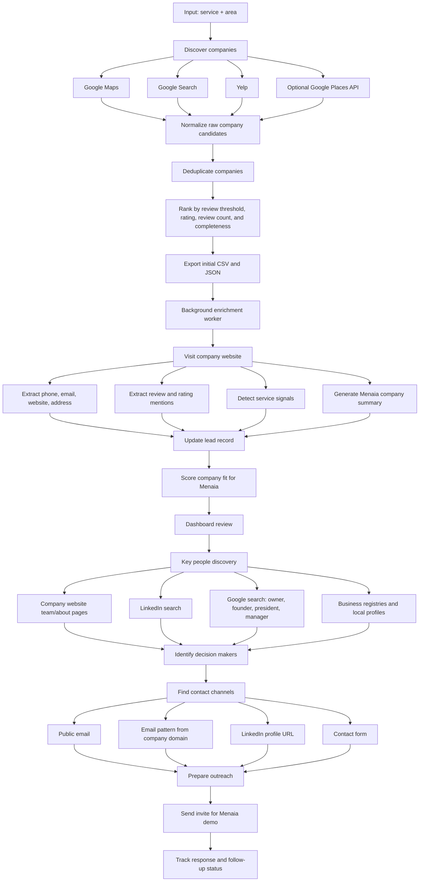

_# Menaia Lead Discovery Process

This document shows the end-to-end process for finding local service companies, enriching them, identifying key people, and preparing demo outreach for Menaia.

## Stage 1: Company Discovery

The first stage searches for companies by:

- `service`, for example `Roofing`
- `area`, for example `Miami, FL`
- `targetCount`, for example `25`
- `minReviews`, for example `50`

The goal is to collect as many relevant companies as possible, then keep the best candidates after deduplication and ranking.

## Stage 2: Company Enrichment

After the first scrape, the background enrichment worker processes each company website and updates the existing CSV/JSON files.

It enriches:

- Company summary for Menaia outreach
- Phone
- Email
- Website
- Review count mentioned on the website
- Rating mentioned on the website
- Service signals
- Lead quality score
- Summary status

## Stage 3: Key People Discovery

The next stage is to identify decision makers inside each company.

Target roles:

- Owner
- Founder
- President
- CEO
- General Manager
- Operations Manager
- Sales Manager
- Office Manager

Potential discovery sources:

- Company website team/about/contact pages
- LinkedIn public search results
- Google search queries like:
  - `"Company Name" owner`
  - `"Company Name" founder`
  - `"Company Name" president`
  - `"Company Name" LinkedIn`
  - `"Company Name" "Operations Manager"`
- Local business directories
- State or city business registry pages when available

Important note: LinkedIn should be handled carefully. The safer approach is to use public search result snippets and profile URLs for discovery, then avoid aggressive scraping or automated account activity.

## Stage 4: Contact Discovery

Once key people are identified, the system should try to find or infer contact channels.

Contact signals:

- Public personal email
- Generic company email
- LinkedIn profile URL
- Contact form URL
- Email pattern from company domain, such as:
  - `first@company.com`
  - `first.last@company.com`
  - `initiallast@company.com`

Every inferred email should be marked as inferred until verified.

## Stage 5: Menaia Demo Outreach

Final outreach data should include:

- Company name
- Company website
- Company phone
- Company email
- Decision maker name
- Decision maker role
- Decision maker LinkedIn URL
- Decision maker email, if available
- Company summary
- Why this company is a good fit for Menaia
- Suggested demo invite message
- Outreach status

Suggested statuses:

- `new`
- `needs_contact`
- `ready_for_outreach`
- `demo_invite_sent`
- `responded`
- `not_interested`
- `follow_up_needed`
